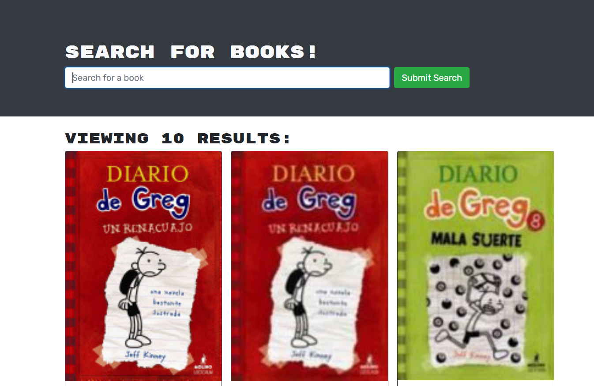

# Book Search Engine

## Description

- What was your motivation?  
  This app was refactored to use GRAPHQL and stop using restapi routing.

- Why did you build this project?  
  To practice more on the side of MERN applications

- What problem does it solve?  
  It is only a refactor, but a the core is a search engine to search for books. It lets the user create an account and add or remove books to a list.

- What did you learn?  
  How to implement latest techonnolies
   
- Briefly describe your Project:  
  This engine allows a user to seach for books in a MERN application style.
   

## Table of Contents

- [Description](#description)
- [Installation](#installation)
- [Usage](#usage)
- [License](#license)
- [Contributors](#contributors)
- [Questions](#questions)

## Installation

What are the steps required to install your project?

    It will be deployed to Heroku.

## Usage

Provide instructions for use:

    If respository is cloned, then you can run "npm i" then "npm seed" and "npm run develop"

## Contributors

Enoc Rojas Villegas

## Questions

Check out my work as well!
Find me on GitHub: 
 (https://github.com/Enrique-Rojas-Villegas)  
Email me: 📧 rojiyoyo@gmail.com
